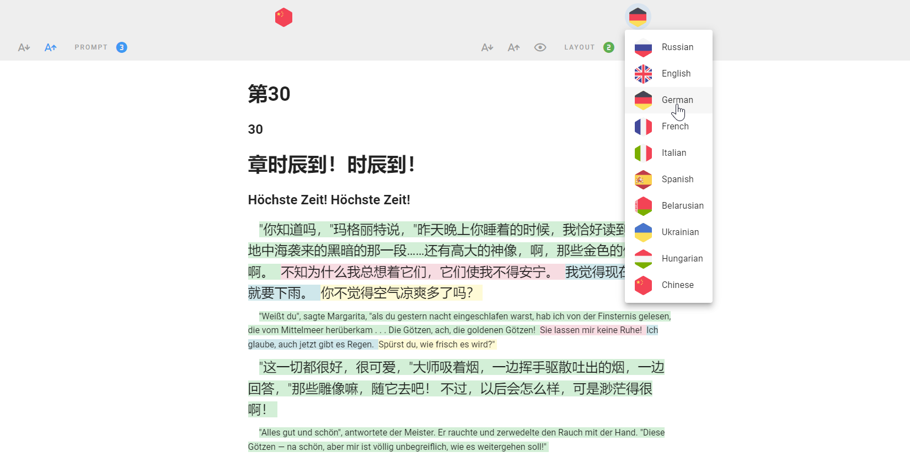

# 📕 Margo

Transformer book. Multilingual parallel version of 'Master and Margarita' novel by Bulgakov.

👉 Book is here:
https://averkij.github.io/margo

## How to make yours

Books were aligned with the [Lingtrain Alignment Studio](https://github.com/averkij/a-studio) project. Please, see the repo for installation details and follow this repo for further instructions.

1. Add content
   - assets/book
   - assets/info
   - assets/img
2. Update PARTS_AMOUNT
3. Update LANGUAGES
4. Update vite.config.js
   `base: '/<your_book_name>/'`
5. Build book
   `npm run build`
6. Copy to your GitHub
